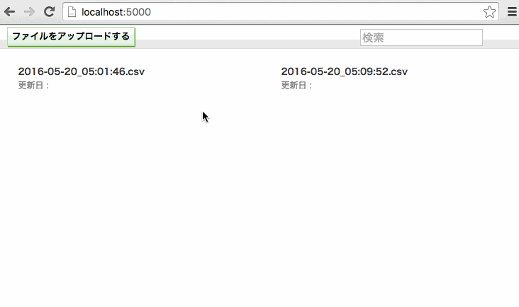

これはなに？
---

csv形式のファイルをアップロードし，web上でグラフを簡単に閲覧するためのサービスです

開発を始める
---

初回のときは次のコマンドを実行してください．

- bundle install
- npm install

次のコマンドを実行してください．

- bundle exec foreman start
- npm run dev

今後
---

- バックエンドをrails にしてもうちょっとしっかりする．
  - filenameを指定できるように
  - タグ付けできるように
  - 比較できるように
  - 表示領域を選択できるように
